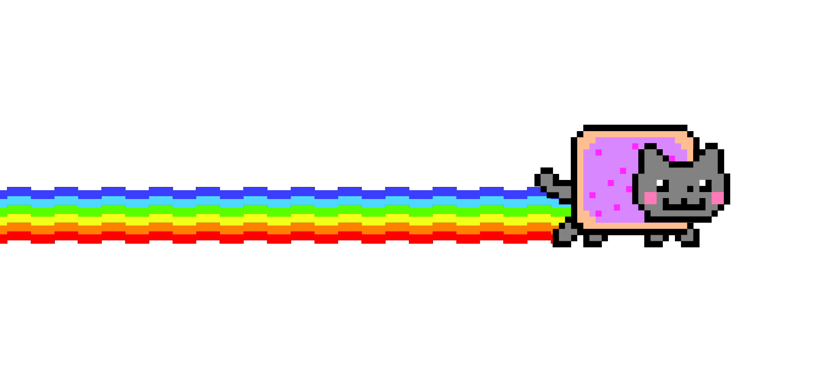

  

 

&nbsp;&nbsp;&nbsp;

  

## About

Developer with a focus on AI and backend systems. Currently deep in the world of LLMs, machine learning, and deep learning — exploring how intelligent systems can be designed, trained, and deployed at scale. Background spans Python, Java, Go, and full-stack work across multiple domains.

 

## Stack

**Languages**&nbsp;&nbsp;

**Frameworks & Tools**&nbsp;&nbsp;

**AI / LLMs**&nbsp;&nbsp;

![Solar](https://img.shields.io/badge/Solar-FF6B35?style=flat-square&logo=data:image/svg%2Bxml;base64,PHN2ZyBoZWlnaHQ9IjFlbSIgc3R5bGU9ImZsZXg6bm9uZTtsaW5lLWhlaWdodDoxIiB2aWV3Qm94PSIwIDAgMjQgMjQiIHdpZHRoPSIxZW0iIHhtbG5zPSJodHRwOi8vd3d3LnczLm9yZy8yMDAwL3N2ZyI%2BPHRpdGxlPlVwc2F0ZTwvdGl0bGU%2BPHBhdGggZD0iTTE5Ljc2MyAwbC0uMzczIDEuMjk3aDIuNTk0TDIyLjM1NCAwaC0yLjU5MXpNMTYuMTkyIDIuMjdsLS4zNzYgMS4yOThoNS41MmwuMzctMS4yOThoLTUuNTE0ek0xMi44OTcgNC41NGwtLjM3NiAxLjI5OGg4LjE2NmwuMzctMS4yOThoLTguMTZ6TTIuODUgNi44MWwtLjM3NyAxLjI5OGgxNy41NjVsLjM3LTEuMjk3SDIuODQ4ek0zLjg4NCA5LjA4MWwtLjM3NiAxLjI5N0gxOS4zOWwuMzctMS4yOTdIMy44ODJ6TTQuMDg4IDI0bC4zNzYtMS4yOTdIMS44NjZMMS41IDI0aDIuNTg4ek03LjY2MiAyMS43M2wuMzc2LTEuMjk3SDIuNTE1TDIuMTUgMjEuNzNoNS41MTN6TTEwLjk1NyAxOS40NTlsLjM3Ni0xLjI5N2gtOC4xN2wtLjM2NiAxLjI5N2g4LjE2ek0yMS4wMDUgMTcuMTg5bC4zNzYtMS4yOTdIMy44MTJsLS4zNjYgMS4yOTdoMTcuNTU5ek0xOS45NjcgMTQuOTE5bC4zNzYtMS4yOTdINC40NjFsLS4zNjYgMS4yOTdoMTUuODcyek0xOC43ODYgMTIuNjQ5bC4zNzYtMS4yOTdINC4yNmwtLjM2NiAxLjI5N2gxNC44OTN6IiBmaWxsPSJ1cmwoI2xvYmUtaWNvbnMtdXBzYXRlLV9SXzBfKSI%2BPC9wYXRoPjxkZWZzPjxsaW5lYXJHcmFkaWVudCBncmFkaWVudFVuaXRzPSJ1c2VyU3BhY2VPblVzZSIgaWQ9ImxvYmUtaWNvbnMtdXBzYXRlLV9SXzBfIiB4MT0iMTEuOTI3IiB4Mj0iMTEuOTI3IiB5Mj0iMjQiPjxzdG9wIG9mZnNldD0iMCIgc3RvcC1jb2xvcj0iI0FFQkNGRSI%2BPC9zdG9wPjxzdG9wIG9mZnNldD0iMSIgc3RvcC1jb2xvcj0iIzgwNURGQSI%2BPC9zdG9wPjwvbGluZWFyR3JhZGllbnQ%2BPC9kZWZzPjwvc3ZnPg%3D%3D&logoColor=white)
![Gemma](https://img.shields.io/badge/Gemma-446EFF?style=flat-square&logo=data:image/svg%2Bxml;base64,PHN2ZyBoZWlnaHQ9IjFlbSIgc3R5bGU9ImZsZXg6bm9uZTtsaW5lLWhlaWdodDoxIiB2aWV3Qm94PSIwIDAgMjQgMjQiIHdpZHRoPSIxZW0iIHhtbG5zPSJodHRwOi8vd3d3LnczLm9yZy8yMDAwL3N2ZyI%2BPHRpdGxlPkdlbW1hPC90aXRsZT48ZGVmcz48bGluZWFyR3JhZGllbnQgaWQ9ImxvYmUtaWNvbnMtZ2VtbWEtX1JfMF8iIHgxPSIyNC40MTklIiB4Mj0iNzUuMTk0JSIgeTE9Ijc1LjU4MSUiIHkyPSIyNS4xOTQlIj48c3RvcCBvZmZzZXQ9IjAlIiBzdG9wLWNvbG9yPSIjNDQ2RUZGIj48L3N0b3A%2BPHN0b3Agb2Zmc2V0PSIzNi42NjElIiBzdG9wLWNvbG9yPSIjMkU5NkZGIj48L3N0b3A%2BPHN0b3Agb2Zmc2V0PSI4My4yMjElIiBzdG9wLWNvbG9yPSIjQjFDNUZGIj48L3N0b3A%2BPC9saW5lYXJHcmFkaWVudD48L2RlZnM%2BPHBhdGggZD0iTTEyLjM0IDUuOTUzYTguMjMzIDguMjMzIDAgMDEtLjI0Ny0xLjEyNVYzLjcyYTguMjUgOC4yNSAwIDAxNS41NjIgMi4yMzJIMTIuMzR6bS0uNjkgMGMuMTEzLS4zNzMuMTk5LS43NTUuMjU3LTEuMTQ1VjMuNzJhOC4yNSA4LjI1IDAgMDAtNS41NjIgMi4yMzJoNS4zMDR6bS01LjQzMy4xODdoNS4zNzNhNy45OCA3Ljk4IDAgMDEtLjI2Ny42OTYgOC40MSA4LjQxIDAgMDEtMS43NiAyLjY1TDYuMjE2IDYuMTR6bS0uMjY0LS4xODdIMi45Nzd2LjE4N2gyLjkxNWE4LjQzNiA4LjQzNiAwIDAwLTIuMzU3IDUuNzY3SDB2LjE4NmgzLjUzNWE4LjQzNiA4LjQzNiAwIDAwMi4zNTcgNS43NjdIMi45Nzd2LjE4NmgyLjk3NnYyLjk3N2guMTg3di0yLjkxNWE4LjQzNiA4LjQzNiAwIDAwNS43NjcgMi4zNTdWMjRoLjE4NnYtMy41MzVhOC40MzYgOC40MzYgMCAwMDUuNzY3LTIuMzU3djIuOTE1aC4xODZ2LTIuOTc3aDIuOTc3di0uMTg2aC0yLjkxNWE4LjQzNiA4LjQzNiAwIDAwMi4zNTctNS43NjdIMjR2LS4xODZoLTMuNTM1YTguNDM2IDguNDM2IDAgMDAtMi4zNTctNS43NjdoMi45MTV2LS4xODdoLTIuOTc3VjIuOTc3aC0uMTg2djIuOTE1YTguNDM2IDguNDM2IDAgMDAtNS43NjctMi4zNTdWMGgtLjE4NnYzLjUzNUE4LjQzNiA4LjQzNiAwIDAwNi4xNCA1Ljg5MlYyLjk3N2gtLjE4N3YyLjk3NnptNi4xNCAxNC4zMjZhOC4yNSA4LjI1IDAgMDA1LjU2Mi0yLjIzM0gxMi4zNGMtLjEwOC4zNjctLjE5Ljc0My0uMjQ3IDEuMTI2djEuMTA3em0tLjE4Ni0xLjA4N2E4LjAxNSA4LjAxNSAwIDAwLS4yNTgtMS4xNDZINi4zNDVhOC4yNSA4LjI1IDAgMDA1LjU2MiAyLjIzM3YtMS4wODd6bS04LjE4Ni03LjI4NWgxLjEwN2E4LjIzIDguMjMgMCAwMDEuMTI1LS4yNDdWNi4zNDVhOC4yNSA4LjI1IDAgMDAtMi4yMzIgNS41NjJ6bTEuMDg3LjE4NkgzLjcyYTguMjUgOC4yNSAwIDAwMi4yMzIgNS41NjJ2LTUuMzA0YTguMDEyIDguMDEyIDAgMDAtMS4xNDUtLjI1OHptMTUuNDctLjE4NmE4LjI1IDguMjUgMCAwMC0yLjIzMi01LjU2MnY1LjMxNWMuMzY3LjEwOC43NDMuMTkgMS4xMjYuMjQ3aDEuMTA3em0tMS4wODYuMTg2Yy0uMzkuMDU4LS43NzIuMTQ0LTEuMTQ2LjI1OHY1LjMwNGE4LjI1IDguMjUgMCAwMDIuMjMzLTUuNTYyaC0xLjA4N3ptLTEuMzMyIDUuNjlWMTIuNDFhNy45NyA3Ljk3IDAgMDAtLjY5Ni4yNjcgOC40MDkgOC40MDkgMCAwMC0yLjY1IDEuNzZsMy4zNDYgMy4zNDZ6bTAtNi4xOHYtNS40NWwtLjAxMi0uMDEzaC01LjQ1MWMuMDc2LjIzNS4xNjIuNDY4LjI2LjY5NmE4LjY5OCA4LjY5OCAwIDAwMS44MTkgMi42ODggOC42OTggOC42OTggMCAwMDIuNjg4IDEuODJjLjIyOC4wOTcuNDYuMTgzLjY5Ni4yNTl6TTYuMTQgMTcuODQ4VjEyLjQxYy4yMzUuMDc4LjQ2OC4xNjcuNjk2LjI2N2E4LjQwMyA4LjQwMyAwIDAxMi42ODggMS43OTkgOC40MDQgOC40MDQgMCAwMTEuNzk5IDIuNjg4Yy4xLjIyOC4xOS40Ni4yNjcuNjk2SDYuMTUybC0uMDEyLS4wMTJ6bTAtNi4yNDVWNi4zMjZsMy4yOSAzLjI5YTguNzE2IDguNzE2IDAgMDEtMi41OTQgMS43MjggOC4xNCA4LjE0IDAgMDEtLjY5Ni4yNTl6bTYuMjU3IDYuMjU3aDUuMjc3bC0zLjI5LTMuMjlhOC43MTYgOC43MTYgMCAwMC0xLjcyOCAyLjU5NCA4LjEzNSA4LjEzNSAwIDAwLS4yNTkuNjk2em0tMi4zNDctNy44MWE5LjQzNSA5LjQzNSAwIDAxLTIuODggMS45NiA5LjE0IDkuMTQgMCAwMTIuODggMS45NCA5LjE0IDkuMTQgMCAwMTEuOTQgMi44OCA5LjQzNSA5LjQzNSAwIDAxMS45Ni0yLjg4IDkuMTQgOS4xNCAwIDAxMi44OC0xLjk0IDkuNDM1IDkuNDM1IDAgMDEtMi44OC0xLjk2IDkuNDM0IDkuNDM0IDAgMDEtMS45Ni0yLjg4IDkuMTQgOS4xNCAwIDAxLTEuOTQgMi44OHoiIGZpbGw9InVybCgjbG9iZS1pY29ucy1nZW1tYS1fUl8wXykiIGZpbGwtcnVsZT0iZXZlbm9kZCI%2BPC9wYXRoPjwvc3ZnPg%3D%3D&logoColor=white)
![Kimi](https://img.shields.io/badge/Kimi-1783FF?style=flat-square&logo=data:image/svg%2Bxml;base64,PHN2ZyBoZWlnaHQ9IjFlbSIgc3R5bGU9ImZsZXg6bm9uZTtsaW5lLWhlaWdodDoxIiB2aWV3Qm94PSIwIDAgMjQgMjQiIHdpZHRoPSIxZW0iIHhtbG5zPSJodHRwOi8vd3d3LnczLm9yZy8yMDAwL3N2ZyI%2BPHRpdGxlPktpbWk8L3RpdGxlPjxwYXRoIGQ9Ik0yMS44NDYgMGExLjkyMyAxLjkyMyAwIDExMCAzLjg0NkgyMC4xNWEuMjI2LjIyNiAwIDAxLS4yMjctLjIyNlYxLjkyM0MxOS45MjMuODYxIDIwLjc4NCAwIDIxLjg0NiAweiIgZmlsbD0iIzE3ODNGRiI%2BPC9wYXRoPjxwYXRoIGQ9Ik0xMS4wNjUgMTEuMTk5bDcuMjU3LTcuMmMuMTM3LS4xMzYuMDYtLjQxLS4xMTYtLjQxSDE0LjNhLjE2NC4xNjQgMCAwMC0uMTE3LjA1MWwtNy44MiA3Ljc1NmMtLjEyMi4xMi0uMzAyLjAxMy0uMzAyLS4xNzlWMy44MmMwLS4xMjctLjA4My0uMjMtLjE4NS0uMjNIMy4xODZjLS4xMDMgMC0uMTg2LjEwMy0uMTg2LjIzVjE5Ljc3YzAgLjEyOC4wODMuMjMuMTg2LjIzaDIuNjljLjEwMyAwIC4xODYtLjEwMi4xODYtLjIzdi0zLjI1YzAtLjA2OS4wMjUtLjEzNS4wNjktLjE3OGwyLjQyNC0yLjQwNmEuMTU4LjE1OCAwIDAxLjIwNS0uMDIzbDYuNDg0IDQuNzcyYTcuNjc3IDcuNjc3IDAgMDAzLjQ1MyAxLjI4M2MuMTA4LjAxMi4yLS4wOTUuMi0uMjN2LTMuMDZjMC0uMTE3LS4wNy0uMjEyLS4xNjQtLjIyN2E1LjAyOCA1LjAyOCAwIDAxLTIuMDI3LS44MDdsLTUuNjEzLTQuMDY0Yy0uMTE3LS4wNzgtLjEzMi0uMjc5LS4wMjgtLjM4MXoiIGZpbGw9IiNmZmYiPjwvcGF0aD48L3N2Zz4%3D&logoColor=white)

 

## Stats

  

 

## Contributions

  <picture>
    <source media="(prefers-color-scheme: dark)" srcset="https://github.com/You42Gwa/You42Gwa/blob/output/github-contribution-grid-snake-dark.svg" />
    <source media="(prefers-color-scheme: light)" srcset="https://github.com/You42Gwa/You42Gwa/blob/output/github-contribution-grid-snake.svg" />
    
  </picture>

 

## Connect

  
  &nbsp;
  

 

